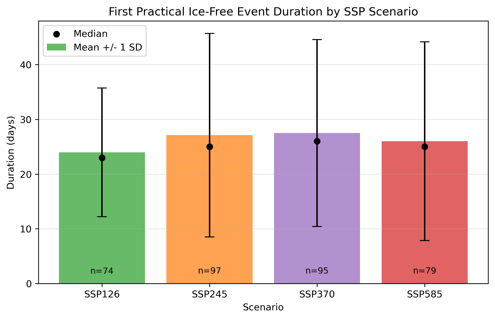
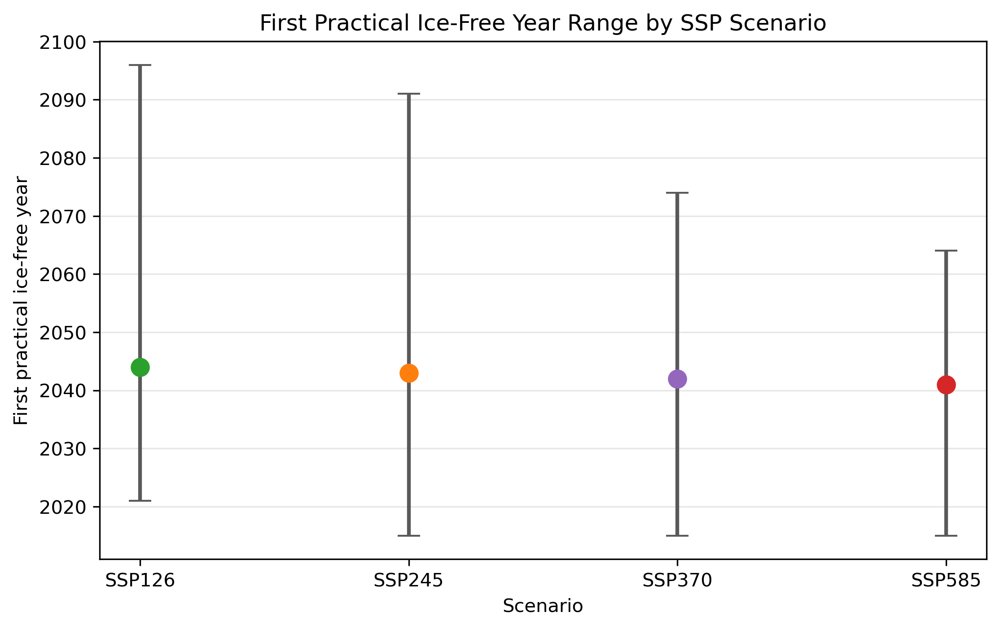

# First Practically Ice-Free Arctic Conditions Across CMIP6 SSP Scenarios

This repository analyzes daily Arctic sea ice area (SIA) and sea ice extent (SIE) from CMIP6 scenario simulations to estimate the first practically ice-free Arctic event for each ensemble member.

A practical ice-free event is defined as Arctic sea ice area below 1 million km2 (`Arctic_SIA < 1e12 m2`). The notebook also tracks an optional actual ice-free metric using `Arctic_SIE == 0`.

## Project Highlights

- Loads public CMIP6 and NSIDC CDR daily Arctic sea ice NetCDF files with `xarray`.
- Standardizes mixed NetCDF time encodings from the public archive for exploratory analysis.
- Identifies the first practical ice-free day, year, and event duration for each ensemble member.
- Compares event duration distributions across SSP126, SSP245, SSP370, and SSP585.
- Visualizes scenario-level duration distributions and ensemble-mean Arctic sea ice area trajectories.

## Key Results

Analysis results show that first practical ice-free event durations overlap strongly across SSP scenarios:

| Scenario | Members with event | Mean duration (days) | Median duration (days) | Earliest first year | Median first year | Latest first year |
| --- | ---: | ---: | ---: | ---: | ---: | ---: |
| SSP126 | 74 | 23.97 | 23 | 2021 | 2044 | 2096 |
| SSP245 | 97 | 27.12 | 25 | 2015 | 2043 | 2091 |
| SSP370 | 95 | 27.51 | 26 | 2015 | 2042 | 2074 |
| SSP585 | 79 | 26.01 | 25 | 2015 | 2041 | 2064 |

Exploratory statistical tests do not show a significant difference in first-event duration distributions across the four analyzed SSPs:

- ANOVA p-value: `0.5401`
- Kruskal-Wallis p-value: `0.553`

Interpretation: higher-emissions scenarios show somewhat earlier upper-end timing and longer tails in some visualizations, but ensemble variability is large relative to scenario-to-scenario differences in the duration of the first practical ice-free event.

## Selected Figures





## Repository Structure

```text
ice-free-arctic-cmip6/
|-- first_ice_free_arctic_ssp_analysis.ipynb
|-- data/
|   |-- CMIP6_historical_data/
|   |-- CMIP6_ssp_data/
|   `-- NSIDC_CDR_daily_v4_SIA_SIE_197901_202312_no_leap.nc
|-- README.md
|-- requirements.txt
|-- environment.yml
`-- .gitignore
```

## Data

The notebook expects the public Arctic Data Center data under `data/`. Raw NetCDF files are ignored by Git and should be downloaded separately.

Primary citation:

> Alexandra Jahn and Celine Heuze. 2024. Daily CMIP6 and NSIDC CDR (National Snow and Ice Data Center Climate Data Record) Arctic sea ice area and sea ice extent, 1980-2100. Arctic Data Center. https://doi.org/10.18739/A2CC0TV9V

Expected local data layout after downloading the data:

- `data/CMIP6_historical_data/`: 146 NetCDF files, about 73 MB
- `data/CMIP6_ssp_data/`: 404 NetCDF files, about 290 MB
- `data/NSIDC_CDR_daily_v4_SIA_SIE_197901_202312_no_leap.nc`: NSIDC observational reference file

## Getting Started

Create an environment with Conda:

```bash
conda env create -f environment.yml
conda activate ice-free
jupyter lab
```

Or install with pip:

```bash
python -m venv .venv
. .venv/Scripts/activate
pip install -r requirements.txt
jupyter lab
```

Then open `first_ice_free_arctic_ssp_analysis.ipynb` and run the notebook from the repository root.

## Notes and Limitations

This is an exploratory analysis. CMIP6 ensemble members and models are not perfectly independent or evenly balanced across scenarios, so statistical comparisons should not be read as definitive attribution tests.

The notebook includes pragmatic time-decoding logic for files with mixed or missing time metadata. A production analysis should validate each file's calendar and units metadata before final publication.

## AI Use Statement

OpenAI Codex was used to help organize this repository, refine notebook formatting, and draft project documentation. The analysis choices, interpretation, and final review remain the author's responsibility.
